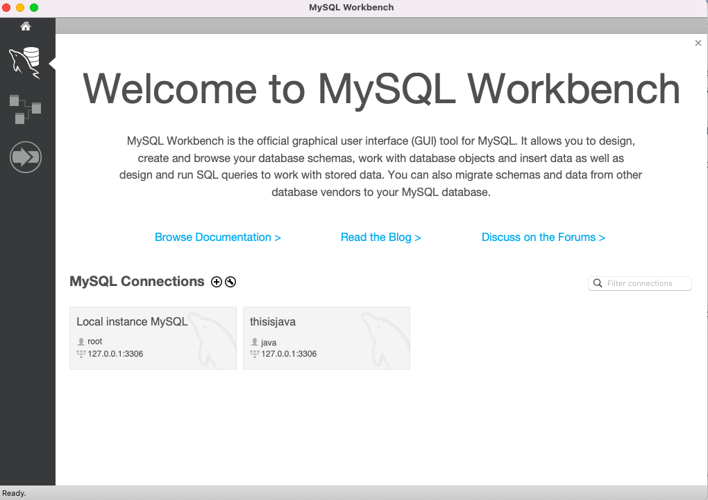
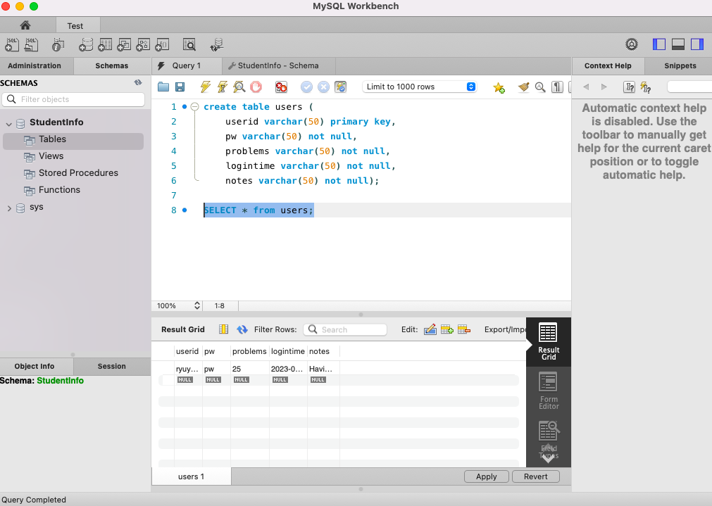

# CSC207_Project #
This is the repository for CSC207 project

## Problem Domain: ## 
Education, Notetaking, Reminders 

## Description of our team's application: ## 
We are planning on creating a meta learning program that enables person to study more effectively by 
various studying habits and techniques. Some examples of our ideas include providing daily contents and reminders
to the user for studying based on the forgetting curve, taking notes with the ability to highlight questions and definitions to elaborate on the problems, and 
generating random tests based on the questions and definitions that the user has highlighted.

## Links to the documentation for an API: ##
1. SQL: https://docs.oracle.com/javase/8/docs/api/java/sql/package-summary.html
2. Swing: https://docs.oracle.com/javase%2F7%2Fdocs%2Fapi%2F%2F/javax/swing/package-summary.html
3. OpenAI: https://platform.openai.com/docs/overview

## A screenshot of using a tool to try out the API: ##
1. MySQLWorkbench

## Example outputs of running the Java code: ##
1. SQL API 

2. JFrame

3. JLabel

##Requirements to Run##
